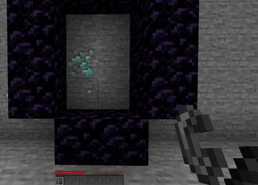
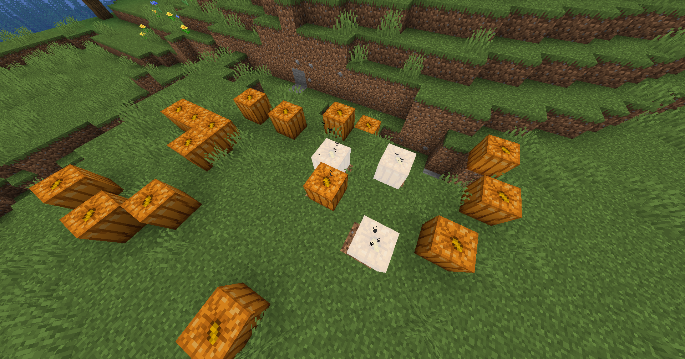
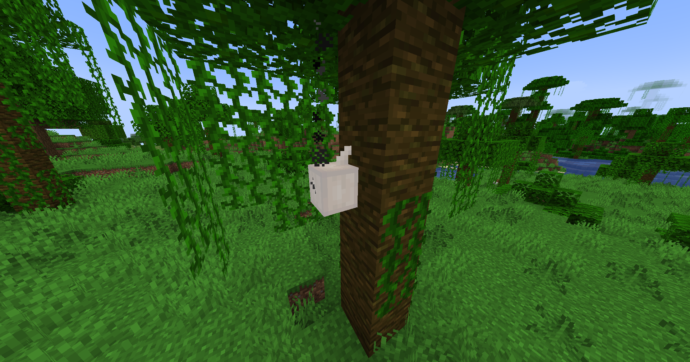

# Everything is TNT

---

This server-side mod makes any block explosive!  
Players can light them with flint and steel.

Entities can also explode!   
The explosion radius is calculated based on the entity's health (don't try to light up a Warden...).

|  |  |
|-----------------------------|-------------------------------|
|      |      |